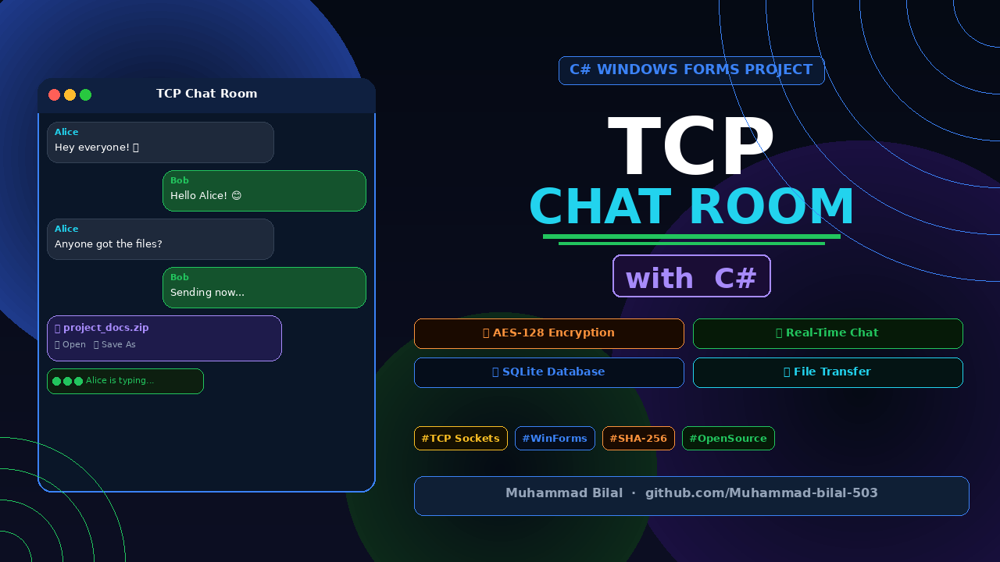
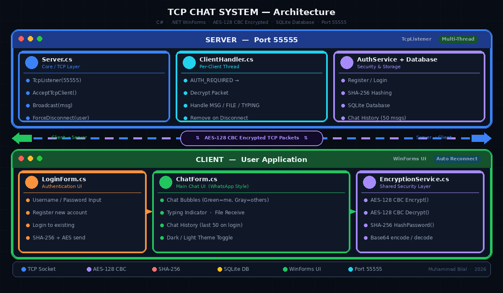
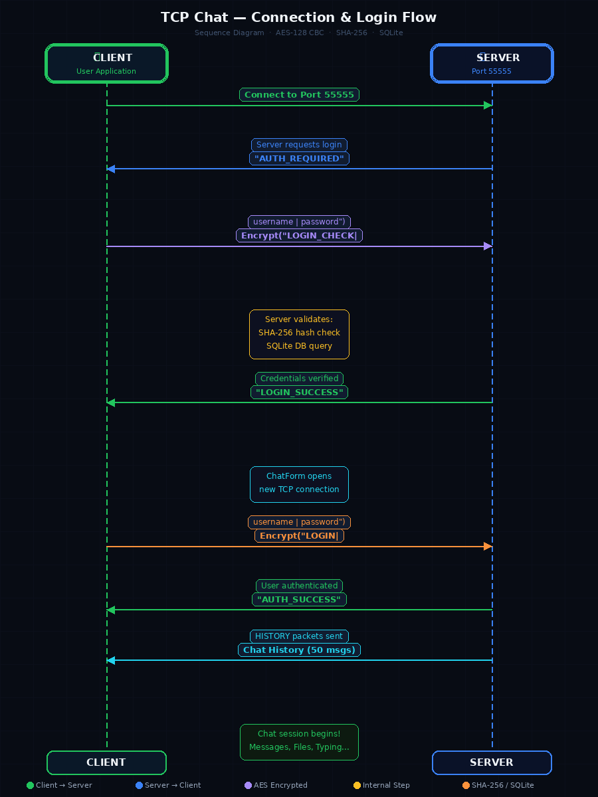
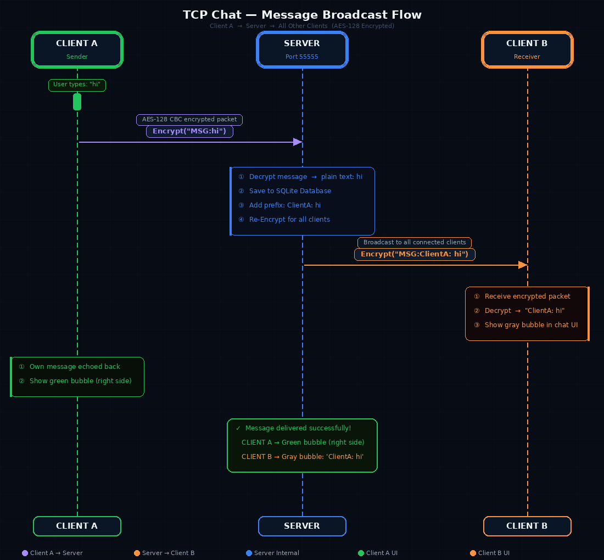
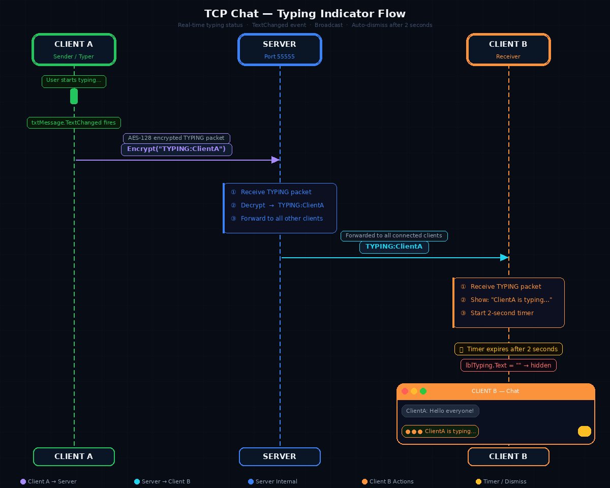
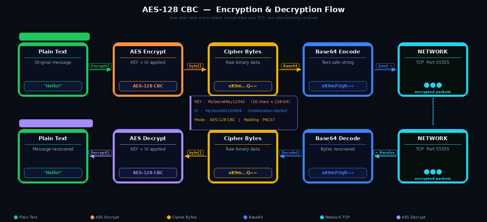

# TCP Chat Room with C#


> A **professional real-time TCP Chat Application** built with C# Windows Forms, featuring end-to-end **AES-128 CBC** encryption, **SHA-256** password hashing, SQLite database, WhatsApp-style UI, and a complete client-server architecture — built entirely using raw TCP Sockets.

<p align="center">
<a href="https://www.youtube.com/watch?v=g_gPZtmxg4I">

</a>
</p>

<p align="center">
<b>🎥 Click the thumbnail above to watch the project demo</b>
</p>
---

##  Table of Contents

- [Overview](#-overview)
- [Features](#-features)
- [Technologies Used](#-technologies-used)
- [Project Structure](#-project-structure)
- [Architecture & Flow](#-architecture--flow)
- [Encryption Details](#-encryption-details)
- [Installation & Setup](#-installation--setup)
- [User Guide](#-user-guide)
- [Security](#-security)
- [Database Schema](#-database-schema)
- [Packet Protocol](#-packet-protocol)
- [Future Improvements](#-future-improvements)

---

##  Overview

This is a **full-featured TCP Chat Application** consisting of two separate C# projects:

| Project | Description |
|---------|-------------|
| **ServerChat** | Server-side application with professional dashboard UI for managing all clients |
| **ClientChat** | Client-side application with WhatsApp-style chat interface and login system |

The application supports **real-time messaging**, **user authentication**, **AES-128 CBC encryption**, **file transfer**, **chat history**, **typing indicators**, and much more — all built from scratch using raw TCP sockets in C#.

---

##  Features

### Authentication & Security
- User **Register** and **Login** system
- Passwords stored as **SHA-256 hashes** — never stored in plain text
- All network packets encrypted with **AES-128 CBC** encryption
- **Duplicate login prevention** — one active session per user at a time
- Server **password-protected force disconnect** feature

###  Chat Features
- **Real-time messaging** over TCP on Port 55555
- **WhatsApp-style chat bubbles** — your messages on right (green), received on left (gray)
- **Sender name** displayed above each received message
- **Timestamp** shown on each bubble
- **Typing indicator** — `"username is typing..."` appears in real-time, disappears after 2 seconds
- **System messages** displayed in center (connected, disconnected, etc.)
- **Chat History** — last 50 messages loaded automatically on every login

###  File Transfer
- Server can **send files** to all connected clients simultaneously
- Files displayed as **WhatsApp-style file bubbles** with:
  -  File name and size
  -  **Open** button — opens file directly
  -  **Save As** button — saves to chosen location
- File messages are **NOT saved** to the database

###  Connection Management
- **Auto reconnect** — automatically tries to reconnect after disconnect
- **Manual reconnect** button available
- Connection status indicator (🟢 Connected / 🔴 Disconnected)

###  Chat History
- All messages **saved to SQLite database** automatically
- **Last 50 messages** loaded on every login
- Each user sees **only their own chat history**
- New users start with a **clean empty chat**
- FILE messages are excluded from history

###  UI / UX
- **Dark theme** (default) and **Light theme** toggle
- WhatsApp-style **rounded chat bubbles** using GDI32.dll
- Professional server dashboard with real-time **client list**
- **Private messaging** from server to a specific client
- **Broadcast messaging** from server to all clients

###  Server Features
- Start / Stop server
- View all **connected clients** in real-time list
- **Force disconnect** a specific client (password protected: `321`)
- Send **broadcast** messages to all clients
- Send **private** message to a selected client
- Send **files** to all connected clients
- Real-time **activity logs** with timestamps
- Logs saved to `server_logs.txt`

---

##  Technologies Used

| Technology | Purpose |
|------------|---------|
| **C# .NET Framework** | Core programming language and framework |
| **Windows Forms (WinForms)** | GUI for both Server and Client applications |
| **TCP Sockets** | Raw network communication over port 55555 |
| **SQLite** | Local database for users and chat message history |
| **AES-128 CBC** | End-to-end encryption of all transmitted packets |
| **SHA-256** | One-way password hashing |
| **System.Data.SQLite** | NuGet package for SQLite integration |
| **Microsoft.VisualBasic** | InputBox dialogs |
| **GDI32.dll (Windows API)** | Rounded corners for WhatsApp-style chat bubbles |

---

##  Project Structure

```
Solution/
│
├──  ServerChat/
│   ├── 📂 Core/
│   │   ├── Server.cs              # TcpListener, client management, broadcast, events
│   │   └── ClientHandler.cs       # Handles each individual client connection (per thread)
│   │
│   ├── 📂 Services/
│   │   ├── AuthService.cs         # Register / Login logic
│   │   ├── DatabaseService.cs     # SQLite operations (users + messages)
│   │   └── EncryptionService.cs   # AES-128 encryption + SHA-256 hashing
│   │
│   ├── Form1.cs                   # Server UI (dashboard, client list, controls)
│   ├── Program.cs                 # Entry point
│   └── App.config
│
└── 📦 ClientChat/
    ├── ChatForm.cs                # Main chat UI (WhatsApp-style bubbles)
    ├── LoginForm.cs               # Register / Login form
    ├── EncryptionService.cs       # AES-128 encryption (same key as server)
    ├── Form1.cs                   # Base form (unused placeholder)
    ├── Program.cs                 # Entry point → LoginForm
    └── App.config
```

---

##  Architecture & Flow

### Overall System Architecture




---

###  Authentication Flow

Two TCP connections are made when a user logs in:

1. **LoginForm** connects → sends encrypted `LOGIN_CHECK` → validates credentials → disconnects
2. **ChatForm** connects → sends encrypted `LOGIN` → receives `AUTH_SUCCESS` + history → session begins



---

###  Message Broadcast Flow

Every message travels through the server before reaching other clients:




---

###  Typing Indicator Flow



---


##  Installation & Setup

### Prerequisites

- **Visual Studio 2019 / 2022** or later
- **.NET Framework 4.7.2** or higher
- **NuGet Package**: `System.Data.SQLite`

### Step 1 — Clone the Repository

```bash
git clone https://github.com/yourusername/tcp-chat-app.git
cd tcp-chat-app
```

### Step 2 — Install NuGet Package

Open **Package Manager Console** in Visual Studio:

```powershell
Install-Package System.Data.SQLite
```

### Step 3 — Build the Solution

```
Build → Rebuild Solution   (Ctrl + Shift + B)
```

### Step 4 — Run Server First

```
Right-click ServerChat → Set as Startup Project → Run (F5)
```

Click **Start** button in server UI → Server starts listening on port `55555`

### Step 5 — Run Client

```
Right-click ClientChat → Set as Startup Project → Run (F5)
```

>  **Important**: Always run **ServerChat first** before any ClientChat instance.  
> You can run **multiple clients** simultaneously to test group messaging.

---

##  User Guide

###  Register an Account

1. Open **ClientChat**
2. Enter your **Username** and **Password**
3. Click **Register** → success message appears
4. Click **Login** to enter the chat

###  Send a Message

1. Type your message in the bottom text box
2. Press **Enter** or click **Send**
3. Your message → **right side** (green bubble)
4. Others' messages → **left side** (gray bubble)

###  Receive a File

When server sends a file, a file bubble appears in chat:
- ** Open** → opens the file directly
- ** Save As** → save anywhere on your computer

###  Reconnect

- Click **Reconnect** button if connection drops
- Or wait — the app **auto-reconnects** automatically

###  Switch Theme

- Click **Toggle Theme** → switches between **Dark** and **Light** mode

---

###  Server Dashboard Guide

| Action | How To |
|--------|--------|
| Start Server | Click **Start** |
| Stop Server | Click **Stop** |
| Broadcast Message | Type in bottom box → Click **Broadcast** |
| Private Message | Select client from list → Type message → Click **Send Private** |
| Send File | Click **Send File** → Select a file |
| Force Disconnect | Select client → Click **Disconnect** → Enter password `321` |
| Toggle Theme | Click **Toggle Theme** |

---

##  Security

### AES-128 CBC Encryption

All data transmitted is encrypted — no packet is readable on the network without the correct key and IV.

All packets between client and server are encrypted using **AES-128 CBC**:




| Setting | Value |
|---------|-------|
| **Algorithm** | AES (Advanced Encryption Standard) |
| **Key Length** | 128-bit (16 characters) |
| **Mode** | CBC — Cipher Block Chaining |
| **Padding** | PKCS7 |
| **Key** | `MySecretKey12345` |
| **IV** | `MySecretIV123456` (Initialization Vector) |
| **Encoding** | Base64 for safe network text transfer |

>  **Note**: For production deployment, the key and IV should be securely stored and not hardcoded.

### SHA-256 Password Hashing

```
User Password  ──▶  SHA-256 Hash  ──▶  Stored in SQLite
```

- Passwords are **never stored in plain text**
- SHA-256 is a **one-way function** — cannot be reversed or cracked easily

### What is Encrypted?

| Data | Encrypted |
|------|-----------|
| Login credentials | ✅ Yes — AES-128 CBC |
| Register credentials | ✅ Yes — AES-128 CBC |
| Chat messages | ✅ Yes — AES-128 CBC |
| Typing indicators | ✅ Yes — AES-128 CBC |
| Chat history packets | ✅ Yes — AES-128 CBC |
| Server handshake responses (`AUTH_REQUIRED`, `AUTH_SUCCESS`) | ❌ No |

---

##  Database Schema

Database file: `chat.db` — auto-created in the Debug folder on first run.

### Users Table

```sql
CREATE TABLE Users (
    Id           INTEGER PRIMARY KEY AUTOINCREMENT,
    Username     TEXT UNIQUE NOT NULL,
    PasswordHash TEXT NOT NULL        -- SHA-256 hash, never plain text
);
```

### Messages Table

```sql
CREATE TABLE Messages (
    Id       INTEGER PRIMARY KEY AUTOINCREMENT,
    Sender   TEXT NOT NULL,
    Receiver TEXT NOT NULL DEFAULT 'all',  -- 'all' = broadcast, username = private
    Message  TEXT NOT NULL,
    SentAt   TEXT NOT NULL                 -- ISO datetime string
);
```

> **Note**: FILE messages are intentionally **excluded** from the Messages table.

---

##  Packet Protocol

| Packet | Direction | Encrypted | Description |
|--------|-----------|-----------|-------------|
| `AUTH_REQUIRED` | Server → Client | ❌ | Server requests authentication |
| `LOGIN\|user\|pass` | Client → Server | ✅ | Login for full chat session |
| `LOGIN_CHECK\|user\|pass` | Client → Server | ✅ | Credential-only check (LoginForm) |
| `REGISTER\|user\|pass` | Client → Server | ✅ | Register a new account |
| `AUTH_SUCCESS` | Server → Client | ❌ | Login successful, session starts |
| `AUTH_FAILED` | Server → Client | ❌ | Wrong credentials |
| `LOGIN_SUCCESS` | Server → Client | ❌ | Credentials valid (LoginForm check) |
| `LOGIN_FAILED` | Server → Client | ❌ | Credentials invalid (LoginForm check) |
| `DUPLICATE_USER` | Server → Client | ❌ | User already has an active session |
| `MSG:text` | Both | ✅ | Encrypted chat message |
| `FILE:name:size` | Server → Client | ❌ | File transfer header |
| `TYPING:user` | Client → Server | ✅ | Typing indicator |
| `HISTORY:sender:msg:time` | Server → Client | ✅ | Chat history item on login |

---

##  Future Improvements

- [ ] Group Chat Rooms / Channels
- [ ] Message Read Receipts (double tick ✓✓)
- [ ] Online / Offline Status indicators
- [ ] Sound notifications on new messages
- [ ] Message search within history
- [ ] User profile picture / avatar
- [ ] File transfer progress bar
- [ ] Server dashboard statistics and graphs
- [ ] RSA key exchange for asymmetric encryption
- [ ] Cross-platform support via .NET 6+

---

##  Author

**Muhammad Bilal**

> Built with ❤️ using C# Windows Forms and raw TCP Sockets

---

##  License

This project is licensed under the **MIT License**.

```
MIT License — Free to use, modify, and distribute with attribution.
```

---

##  Acknowledgements

- **System.Data.SQLite** — SQLite for .NET
- **Windows GDI32 API** — Rounded corners for chat bubbles
- **System.Security.Cryptography** — AES-128 and SHA-256 implementations
- **.NET Framework** — TCP Sockets and Windows Forms foundation
